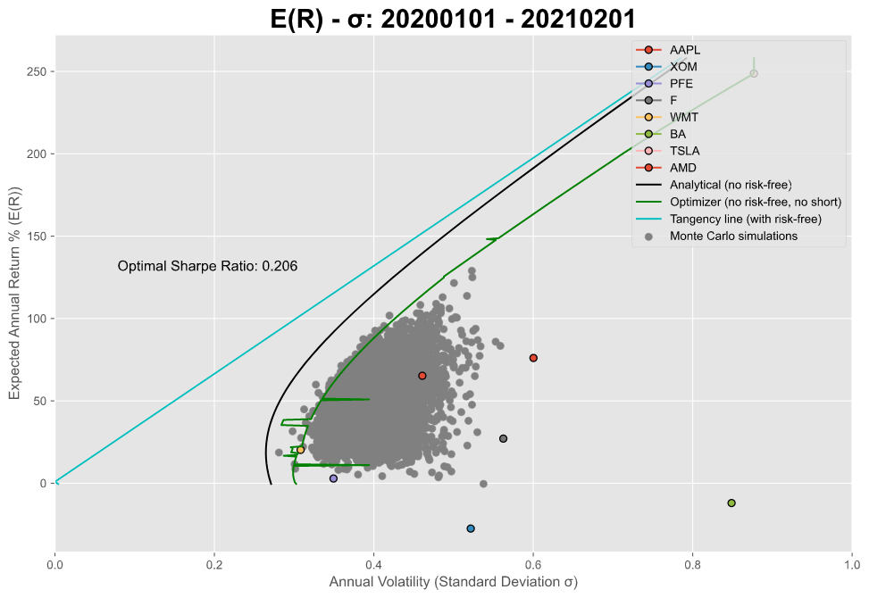
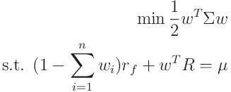
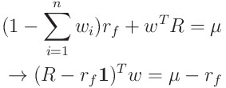

# Efficient-Frontier

## References
* [Wikipedia - Modern portfolio theory - Mathematical Model](https://en.wikipedia.org/wiki/Modern_portfolio_theory)

* [马科维茨投资模型](https://mp.weixin.qq.com/s/0RlN0UTh3slFgErd8XRGhQ)

* [Foundations of Financial Engineering (Columbia University, Fall 2016)](http://www.columbia.edu/~mh2078/FoundationsFE.html#:~:text=It%20is%20a%20core%20course,and%20financial%20problems%20and%20products.)

## Brief

Analysis on the modern portfolio theory.

* Efficient frontier with / without risk free asset
* Optimal sharpe ratio / portfolio

## Example of usage

```python
instance = EfficientFrontier(
    tickers=["AAPL", "XOM", "PFE", "F", "WMT", "BA", "TSLA", "AMD"],
    start_date="20200101",
    end_date="20210130", 
    simulation_times=5000, 
    solve_granularity=1000, 
    analytical_solution=True,
    use_optimizer=True,
    tangency_line=True,
)
instance.plot((12,8))
```



## Content

- Monte Carlo simulation of portfolios consisting of assets in the designated pool.
- Solve for the curve of the efficient frontier **without risk-free asset** analytically (a constrained optimization problem) using lagrange multiplier. This solution did not take into consideration the constraint that all weights are greater than 0, a.k.a. it allows short and leverage.
  - 

<!-- Rendering provided by http://www.sciweavers.org/free-online-latex-equation-editor -->
<!-- $$
\begin{bmatrix}2\Sigma &-R & -{\bf1}\\ R^T &0 & 0 \\ {\bf1}^T &0 &0 \end{bmatrix} 
* \begin{bmatrix}w\\\lambda_1\\\lambda_2\end{bmatrix} 
= \begin{bmatrix}0\\\mu \\ 1\end{bmatrix}
$$ -->

- (2021/1/30 Update) `optimizerSolver()` to solve for the efficient frontier using scipy optimizer. Due to the limit of the optimizer, this solution performs bad for low `mu` part.

- (2021/2/1 Update) `tangencySolver()` which solves for the "with risk-free asset" case. The solution can be proved to be the tangency line of the efficient frontier curve in the "no risk-free asset" setting.

- Plotting the figure of all above.

### 2021/2/1: Frontier with risk-free asset —— the tangency line

Consider the constrained problem that


<!-- $$ \min{\frac12 w^T\Sigma w} 
\\\text{s.t. } (1 - \sum_{i=1}^n{w_i})r_f + w^TR = \mu\\
$$ -->

Lagrange multiplier:


<!-- $$F = \frac12 w^T\Sigma w - \lambda[w^T(R - r_f {\bf1}) - (\mu - r_f)] $$  -->


<!-- $$\frac{\partial F}{\partial w} = \Sigma w - \lambda(R - r_f {\bf1}) = 0 \\
\to w = \lambda \Sigma^{-1} (R - r_f {\bf1})$$ -->



<!-- $$ (1 - \sum_{i=1}^n{w_i})r_f + w^TR = \mu \\
\to (R - r_f {\bf1})^T w = \mu - r_f $$ -->

Solution:


<!-- $$\therefore \lambda = \frac{\mu - r_f}{(R - r_f {\bf1})^T\Sigma^{-1}(R - r_f {\bf1})} \\
w = \lambda\Sigma^{-1} (R - r_f {\bf1}) = \frac{(\mu - r_f)\Sigma^{-1} (R - r_f {\bf1})}{(R - r_f {\bf1})^T\Sigma^{-1}(R - r_f {\bf1})}$$ -->

It can be proved that  for any combination of risk-free asset   and any risky asset  . Therefore, if we got an optimal efficient risky portfolio without risk-free asset, the efficient frontier with risk-free asset should be the tangency line which crosses that point.